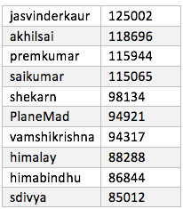

# Udacity Data Analyst Nanodegree – Project Submission

## Project: Wrangle OpenStreetMap Data

The city that I am exploring for this project is Bangalore, a city where I have lived the last 6 years and where my data science career took off. I have never looked at Bangalore through OpenStreetMaps, so this is without a doubt, exciting. Owing to cultural differences and place names being differently used by different people (For e.g. ‘Koramanagala’ a busy part of Bengaluru, is often labelled ‘Kormangla’ my people who are from North India). Such differences means we can expect to see a lot of cleaning opportunity with the dataset.



### Data Audit

The metro extract for Bengaluru was downloaded which is a about 650 MB in size. To get a sense of the data, I parsed the ‘osm’ file with the map_parse.py script, which gives the following output


### Tags – Patterns

Tags.py, a script that counts the tags based on their formatting. With the help of regular expression, we count the tags in the Bengaluru OSM file which are in lower case, those with a colon in them, and tags which have problematic characters in them. If a tag does not belong to any of these three, they are counted as other.



### Street Address Inconsistencies

There are a lot of inconsistencies in the street address data. To a large extent, this is because there is no standard way streets are named in India and this leads to long addresses being used most of the time. For instance, consider the following examples – 

> 14Th Main, 5Th Sector, HSR Layout  

> 14Th Main, 50Th Cross, Rajajinagar 3Rd Block  

> Near Embassy Tech, Marathahalli Outer Ring Road, Deevarabeesanahalli  

Streets with similar name (14th Main, for e.g.) mean that contributors to OpenStreetMap have to give as much information as possible. 

This presents a huge challenge in terms of cleaning the data and standardizing the street addresses. However, we can still clean the dataset and fix common formatting errors. Some of these are as follows

* Use of Abbreviations - Rd, Rd., St., St renamed as Road & Street
* Sometimes, streets with names such as 3rd Cross Road or 4th Main Road, are simply named 3rd Cross or 4th Main. This can be fixed by adding the word ‘Road’ to them.
* Other instances where small caps are used as the starting letters of such street names (cross, main, layout, nagar etc.) can be renamed to sentence case.

Here are a few examples of instances where the street addresses were cleaned


This was achieved by 
* Check if a street address is in an expected correct format
* If not, it is cleaned according to a mapping dictionary with common input errors (such as the ones in left column of the table above), and the update function returns the cleaned address (as shown in the right column of the table above)

### Converting to CSV

The next part of the project is to parse the elements of the OSM XML file to tabular format, thus making it possible to write them to CSV files. In the next part, we will import theses CSV files into an SQL database.

The process is as follows
-	Use iterparse to interatively step through each top level element in the XML
-	Shape each element into several data structures using a custom function
-	Utilize the provided schema.py script to transform the data in the correct format
-	Write each data structure to the appropriate CSV files

The below top level elements and attributes were used:

* 1.	Node
	* id
	* user
	* uid
	* version
	* lat
	* lon
	* timestamp
	* changeset
* Node Tags
	* id
	* key
	* value
	* type
* Way
	* id
	* user
	* uid
	* version
	* timestamp
	* changeset
* Way Nodes
	* id
	* node_id
	* position
* Way Tags
	* id
	* key
	* value
	* type

The transformed CSV files are as follows


### CSV to Database

In the next step, I imported the csv files as tables in to a database using the database.py script. This script used the sqlite module to create a database and with the use of the csv module, reads the csv files and converts each (which were already created as per the schema we need), onto the new database. 

Before converting to CSV, we call the update street name function in audit.py to clean the street names as mentioned in the above section.

The new database ‘bengaluru.db’ is 449.9 MB large.


### Querying and Analyzing Data from the Database

#### Number of nodes in bengaluru.db

```
SELECT COUNT(*) FROM NODES
```

> 2879133  

#### Count of ways

```
SELECT COUNT(*) FROM WAYS
```

> 660030  

#### Unique Users

```
SELECT COUNT(DISTINCT allusers.uid) FROM 
	(SELECT uid FROM NODES
	 UNION All
	 SELECT uid FROM WAYS) allusers
```

> 1943  

#### Top 10 Amenities in Bengaluru

```
SELECT value, COUNT(*) as num 
FROM nodes_tags 
WHERE key="amenity" 
GROUP BY value 
ORDER BY num DESC 
LIMIT 10
```




Similarly, we can also look at the top places in Bangalore tagged as ‘Leisure’ spots



#### Top Contributing Users

```
SELECT allusers.user, COUNT(*) as num 
FROM (SELECT user FROM nodes UNION ALL SELECT user FROM ways) allusers 
GROUP BY e.user 
ORDER BY num desc 
LIMIT 10
```


We also know that of the 1943 users who have contributed to the Bengaluru map, 26% (503 users) have made only one contribution. 

### Conclusion

The Bengaluru dataset provides a lot of opportunities for data wrangling since as mentioned before, there is no clear standardized way that is accepted to name streets. This results in complicated and often long ways to name a street (long addresses). However, we managed to clean many typo errors in the names that are common to human entered data in platforms such as OpenStreetMaps.

That said, cleaning the street addresses would be part of a bigger project where each area is considered separately, a strategy is create to standardize the street addresses and each separate area is wrangled separately to achieve this sort of a standardization.

Also, it should be noted that this becomes an ongoing data quality exercise to clean new data, and also efforts to let users know of city specific guidelines so that these errors can be minimized in the future.
